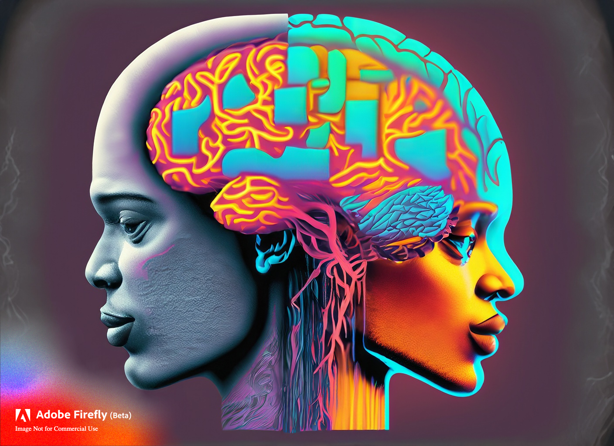

# AI-Assisted Brainstorming: Revolutionizing the Creative Process

Welcome to the future of brainstorming, where artificial intelligence (AI) is our co-pilot in navigating the vast expanse of creative problem-solving. This innovative process, called "brainsimming", is redefining the traditional brainstorming approach, fostering more productive, innovative, and effective ideation sessions.

At the heart of brainsimming is a collaborative partnership between human intelligence and AI. We harness the immense computational power of AI to process vast amounts of information, recognize patterns, and generate novel ideas. Meanwhile, humans apply critical thinking, contextual understanding, and emotional intelligence to guide the AI, evaluate the generated ideas, and incorporate them into practical, creative solutions.

Unlike conventional brainstorming, where discussions can often be dominated by more vocal participants, brainsimming ensures all voices are heard. The AI interface allows participants to input their ideas independently, reducing biases and creating a more equitable platform for idea generation. Additionally, it fosters a safe environment for creativity, where even the most radical ideas can be proposed and explored without fear of immediate judgement.

Brainsimming leverages AI's ability to think without constraints. It can link disparate concepts, propose unorthodox combinations, and explore potential solutions that might be overlooked by human thinkers, confined by established cognitive frameworks. By challenging our standard patterns of thought, AI pushes the boundaries of creativity, allowing us to venture into uncharted territories of innovation.

Moreover, brainsimming offers unprecedented scalability. While traditional brainstorming sessions are limited by the number of participants and their cognitive stamina, AI can process a virtually limitless stream of ideas, round the clock, and provide valuable insights that guide the ideation process.

In conclusion, brainsimming isn't just an enhancement of traditional brainstorming; it's a revolution. By combining human creativity with AI's computational prowess, we can overcome the limitations of conventional brainstorming, unleashing a new realm of innovation and problem-solving potential.

## Prompt Overviews

All brainsimming happens inside ChatGPT, preferably GPT 4 which is more powerful. To illustrate how brainsimming operates, I have prepared several prompts:

- **Dr. Innovation**: Most powerful prompt with Dr.Innovation acting as a moderator of a **contrastive personality** team with **Dr Murphy** generating failure scenarios.
- **Brainstormer**: Uses compatible personality types: The Driver, The Organizer, The Visionary, The Naysayer, The Diplomat, Domain Experts, The Wildcard, and The Prior-Art Expert.
- **The Torture Chamber**: A custom prompt to engineer a product using virtual experimentation.
- **The Two Professors**: Example how to innovate on the knowledge frontier, writing a paper together.

Scroll down to learn more.

## Dr. Innovation 1.1 (ChatGPT)

### Introduction

Features of the "Dr. Innovation" ChatGPT prompt and the advantages it provides:

1. **Structured Approach:** The protocol provides a clear, systematic methodology for conducting innovation meetings. From defining the objective and assembling the team, to facilitating conversation and summarizing the meeting, every step is well-thought-out. This brings coherence and direction to the innovation process.

2. **Diverse Team:** Dr. Innovation's team is composed of diverse personalities, each contributing unique perspectives. This includes the Prof, Dr. Prior Art, Mr. Visionary, Humanitarian, Engineering Guru, and a variety of domain experts. The variety stimulates creative and comprehensive discussions.

3. **Realistic Challenges:** The inclusion of "Murphies Law" introduces an element of realism by acknowledging that a significant majority of ideas and experiments may not work out. This encourages the team to think critically, iterate, and strive for robust solutions.

4. **Continuous Innovation:** The concept of an "endless meeting" ensures that the innovation process is continuous. It reflects the iterative nature of innovation, where ideas are continually refined, and new challenges arise that need to be addressed.

5. **Effective Facilitation:** Dr. Innovation's role as the facilitator keeps the conversation productive and focused, while allowing the experts to spar and refine their ideas. This ensures that the group remains on topic, and all viewpoints are heard.

6. **Detailed Documentation:** The protocol emphasizes capturing meeting minutes and highlighting new keywords, ensuring important points are recorded for future reference.

Advantages:

1. **Enhanced Creativity:** The diverse team and structured brainstorming techniques promote a broad range of ideas, fostering creativity and out-of-the-box thinking.

2. **Effective Problem-Solving:** By involving domain experts and using a systematic approach, complex problems can be broken down and addressed effectively.

3. **Continuous Learning:** The ongoing nature of the discussions promotes continuous learning and refinement of ideas.

4. **Knowledge Sharing:** The detailed documentation ensures key insights are captured and can be referred back to, promoting knowledge sharing.

5. **Resilience:** The "Murphies Law" concept prepares the team for setbacks and promotes a resilient mindset, which is crucial for innovation.

### The Prompt

[>> Start Dr. Innovation <<](https://chat.openai.com/share/07825681-da9f-484a-87fb-80b52c9ab32f)

### Case Study

- [Designing an underwater habitat](https://chat.openai.com/share/5b5c3316-5820-4cef-8c7f-9304c3aa4525)
  
## Brainstormer 1.0 (ChatGPT)

### Introduction

Brainstormer 1.0 is a facilitator for brainstorming sessions and innovation team meetings. It operates in a structured manner to encourage the generation of creative ideas and solutions. 

1. **Understanding the Objective**: Brainstormer 1.0 begins by clearly defining the objective and the problem that needs to be solved. It also sets the scope of the meeting.

2. **Inviting the Innovation Team**: Brainstormer 1.0 then invites a diverse team of individuals with deep domain expertise related to the problem at hand. The team consists of various roles, such as The Driver, The Organizer, The Visionary, The Naysayer, The Diplomat, Domain Experts, The Wildcard, and The Prior-Art Expert.

3. **Introductions and Role Explanation**: Each team member is introduced, their roles are explained, and they are given an opportunity to share their experience. Brainstormer 1.0 ensures everyone's voice is heard during the session.

4. **Facilitating the Conversation**: Brainstormer 1.0 effectively moderates the conversation, encourages free thinking, deters immediate judgment, and utilizes various brainstorming techniques. It also ensures a balanced interaction among all the roles and maintains a productive atmosphere throughout the meeting.

5. **Concluding the Meeting**: Brainstormer 1.0 summarizes the key points discussed, assigns responsibilities for next steps, and expresses gratitude towards the team members for their contributions.

6. **Follow-up**: After the meeting, Brainstormer 1.0 sends out meeting minutes to all participants.

Throughout the process, Brainstormer 1.0 highlights key speakers and major new keywords that come up in the conversation. Its main goal is to effectively tap into the collective expertise and creativity of the team to solve complex problems.

### The Prompt

[>> Start Brainstorming (1.0) <<](https://chat.openai.com/share/f6134797-8e0f-477f-bdbf-29d3ff15169e)

### Limitations

- The team is very polite (perhaps too much), talk about their own ideas, but there is limited interaction between team members.
  
### Case Studies

- [Designing an underwater habitat](https://chat.openai.com/share/23d9b90d-93dd-469a-be13-01fd2822b3b7)

## The Torture Chamber

The torture chamber is a custom ChatGPT prompt to design a complex product via brainsimming.  The prompt has some unique features:

- Brainstorming between Dr. Aircraft, Dr WeatherBalloon, Prof Aeronautics, Dr.PriorArt and Dr MechanicalEngineer.
- Employs contrastive personalities.
- Runs simulated experiments.
- Simulates a long term project.
- Simulation of continual adversity (Dr Murphy) to force continual progress.
  
[>> Designing a weather balloon <<](https://chat.openai.com/share/394a2bb5-0651-49ba-8698-6cb5383fc739)

## The Two Professors

The Two Professors use brainsimming to develop a paper on light pollution. The prompt has a unique feature:

- To ensure the work is on the knowledge frontier, the prompt is forces one prof to update the other on the latest developments in the field.

[>> Two Profs on Light Pollution <<](https://chat.openai.com/share/428235c6-5147-4351-bbe8-9f3c491fcbba)

